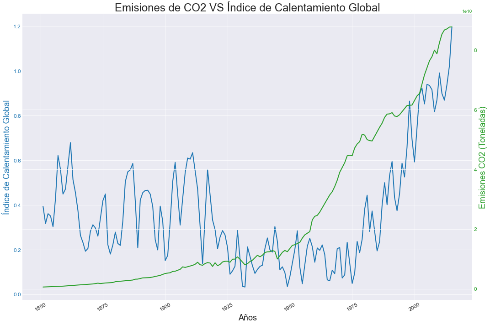

# **ANÁLISIS EXPLORATORIO DE DATOS (EDA)**
## **CAMBIO CLIMÁTICO**
---
Hemos recopilado datos clave de diferentes fuentes de información: Principalmente de [KAGGLE.](https://www.kaggle.com/datasets)  

**Datasets usados:**
> * [Climate Change: Earth Surface Temperature Data](https://www.kaggle.com/datasets/berkeleyearth/climate-change-earth-surface-temperature-data)
> * [CO2_GHG_emissions-data](https://www.kaggle.com/datasets/yoannboyere/co2-ghg-emissionsdata)

Los datos sin procesar provienen de la página de datos de [Berkeley Earth](http://berkeleyearth.org/) y [Our World In Data](https://ourworldindata.org/). 
 
----
### **OBJETIVO**
Queremos realizar la evolución de las temperaturas globales con respecto al tiempo, con ello podemos deducir si realmente el cambio climático es algo real. Primero de todo analizaremos temperaturas globales, para poder ver en que manera está influyendo en nuestro territorio. 

----

## **PARTE 1. INCREMENTO DE TEMPERATURA E ÍNDICE DE CALENTAMIENTO GLOBAL (ICG)**
Datos de temperatura:
>Tenemos datos Terrestres desde 1750 a la actualidad, y tenemos datos Globales (Oceánicos y Terrestres) desde 1850 a la actualidad. Los datos útiles empiezan en 1850, y acontinuación demostramos el por qué.

>En este Gráfico podemos observar como se ha incrementado la temperatura terrestre desde 1850 a 2015.  

>En este otro Gráfico observamos como se ha incrementado la temperatura terrestre y oceánica juntas desde 1850 a 2015.  
>Comparemos los dos gráficos:

>¿Es fácil de comparar?, ¿es representativo?. La respuesta es NO, a lo largo de los años las temperaturas medidas en grados pierden valor y no son representativas, por lo que usamos un indicador: ÍNDICE DE CALENTAMIENTO GLOBAL.

### Los indicadores ambientales vienen dados por:
#### 1. Índice de Calentamiento Global, donde se valora la variación en la temperatura a lo largo de todo el periodo analizado.

#### 2. Anomalía térmica media anual, es decir, la desviación de la temperatura media anual con respecto a la media de la serie.

### El índice del Calentamiento Global se calcula de la siguiente manera:

* #### Primera etapa: Cálculo de la anomalía media mensual
>## *AM(i) = Tmed(i) - Tmed*
>
>siendo:
>AM(i) = Anomalía media anual  
>Tmed(i) = Temperatura media del año analizado  
>Tmed = Temperatura media anual de la serie  
  
* #### Segunda etapa: Cálculo del incremento medio anual con respecto al año anterior
>## *IAM = AM(i) + IAM(i-l)*
>
>siendo:
>IAM = Incremento acumulado medio  
>AM(i) = Anomalía media anual
>IAM(i-l) = Anomalía media anual del año anterior

* #### Tercera etapa: Determinación del Índice de Calentamiento Global
>## *GC = (AM(i) + IAM) / 2*
>
>siendo:
>IGC = Índice de Calentamiento Global  
>AM(i) = Anomalía media anual   
>IAM = Incremento acumulado medio 

## Índice de Calentamiento Global (ICG)

> El ICG es un estándar aceptado por diferentes organizaciones, y es un indicador más acertado para comparar el calentamiento global con series temporales.  
>Podemos observar como a partir de 1975 empieza un aumento exponencial del ICG.

> Con este gráfico comparamos el ICG terrestre y el ICG global, podemos observar como el global fluctúa menos y tiene menos ruido en el índice, por lo que es una medida más fiable.

## **PARTE 2. EMISIONES DE CO2 (TONELADAS)**
Estudiaremos las emisiones de CO2 globales por año para poder comparar con el Índice de Calentamiento Global

>Podemos observar como las emisiones de CO2 han aumentado de forma exponencial.

### Comparamos, en dos ejes diferentes, EL Índice de Calentamiento Global con las emisiones de CO2 y sacamos las correlaciones de todas las variables utilizadas:

>Observamos una cierta correlación, vamos a analizar si esto es cierto

> Con el gráfico de correlaciones vemos que nuestras dos variables a comparar están correlacionadas en un 0.54, una correlación alta.

## **CONCLUSIONES**
El análisis del índice de calentamiento global varía en función de la escala temporal que se aplique. Antes de 1925, tanto los protocolos como los intrumentos para realizar mediciones eran más rudimentarios, por lo que nuestras medidas son más inestables antes de esa fecha.

Utilizaremos el periodo base usado por la NASA, el cual acotar a una serie temporal de 30 años (1985-2015).

>En 30 años se puede observar que existe una alta correlación entre las emisiones de CO2 y el índice de calentamiento global.

> También podemos observar como las correlaciones han aumentado considerablemente al acotar la serie temporal a 30 años, la correlación entre ICG y las emisiones de CO2 han pasado de valer 0.54 a ---> 0.86.

----
# [Presentacion](https://www.canva.com/design/DAFAzyXCJd0/-UbMAvKws2DWCxy0MGqKvA/view?utm_content=DAFAzyXCJd0&utm_campaign=designshare&utm_medium=link&utm_source=publishsharelink) - link de la presentación del EDA

---
## Librerías usadas:
* [Pandas](https://pandas.pydata.org/docs/)
* [Numpy](https://numpy.org/doc/)
* [Seaborn](https://seaborn.pydata.org/)
* [Matplotlib](https://matplotlib.org/)
* [Plotly](https://plotly.com/python/)

## Enlaces de interés:
* [Kaggle](https://www.kaggle.com/datasets)
* [Junta de Andalucía - Medio Ambiente](https://www.juntadeandalucia.es/medioambiente/portal/home)
* [Junta de Andalucía - Datos abiertos](https://www.juntadeandalucia.es/datosabiertos/portal/)
* [Our World in Data](https://ourworldindata.org/)
* [NASA](https://www.nasa.gov/)
* [Berkeley Earth](http://berkeleyearth.org/)
# Eda_CambioClimatico
